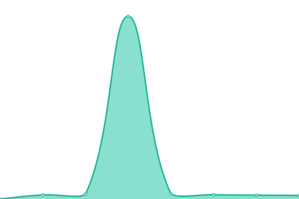
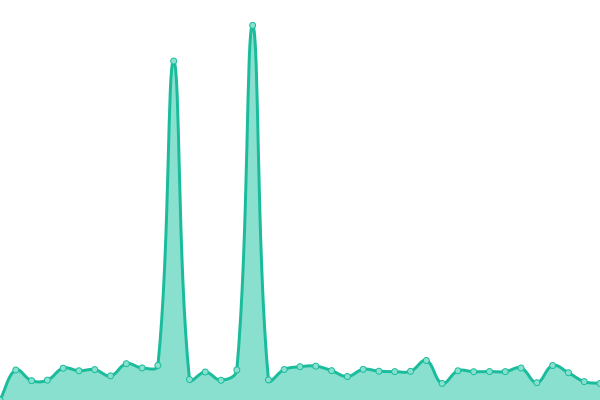

# [📈 Live Status](https://yacosta738.github.io/monitor-app): <!--live status--> **🟩 All systems operational**

This repository contains the open-source uptime monitor and status page for [Yuniel Acosta Pérez](https://www.blastkode.com), powered by [Upptime](https://github.com/upptime/upptime).

With [Upptime](https://upptime.js.org), you can get your own unlimited and free uptime monitor and status page, powered entirely by a GitHub repository. We use [Issues](https://github.com/yacosta738/monitor-app/issues) as incident reports, [Actions](https://github.com/yacosta738/monitor-app/actions) as uptime monitors, and [Pages](https://yacosta738.github.io/monitor-app) for the status page.

<!--start: status pages-->
<!-- This summary is generated by Upptime (https://github.com/upptime/upptime) -->
<!-- Do not edit this manually, your changes will be overwritten -->
<!-- prettier-ignore -->
| URL | Status | History | Response Time | Uptime |
| --- | ------ | ------- | ------------- | ------ |
|  [Google](https://www.google.com) | 🟩 Up | [google.yml](https://github.com/yacosta738/monitor-app/commits/HEAD/history/google.yml) | 

 103ms
     
 | 

<a href="https://yacosta738.github.io/monitor-app/history/google">100.00%</a>
    

|  [Github](https://www.github.com) | 🟩 Up | [github.yml](https://github.com/yacosta738/monitor-app/commits/HEAD/history/github.yml) | 

 390ms
     
 | 

<a href="https://yacosta738.github.io/monitor-app/history/github">100.00%</a>
    

|  [Portfolio and Blog](https://www.yunielacosta.com) | 🟩 Up | [portfolio-and-blog.yml](https://github.com/yacosta738/monitor-app/commits/HEAD/history/portfolio-and-blog.yml) | 

 536ms
     
 | 

<a href="https://yacosta738.github.io/monitor-app/history/portfolio-and-blog">100.00%</a>
    

|  [n8n render](https://n8n-k4aj.onrender.com/webhook/ad4ca19a-4b03-4906-8e57-a4a861bfbbaf) | 🟩 Up | [n8n-render.yml](https://github.com/yacosta738/monitor-app/commits/HEAD/history/n8n-render.yml) | 

 1106ms
     
 | 

<a href="https://yacosta738.github.io/monitor-app/history/n8n-render">92.82%</a>
    

<!--end: status pages-->

[**Visit our status website →**](https://yacosta738.github.io/monitor-app)

## 📄 License

- Powered by: [Upptime](https://github.com/upptime/upptime)
- Code: [MIT](./LICENSE) © [Yuniel Acosta Pérez](https://www.blastkode.com)
- Data in the `./history` directory: [Open Database License](https://opendatacommons.org/licenses/odbl/1-0/)
